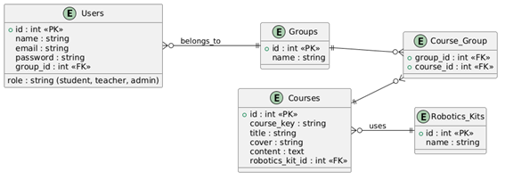

# Activity 7 - Robotics Learning Platform

## Project Description
This project is a Laravel web application designed for a robotics school to manage courses, groups, and users, the system allows administrators, teachers, and students to access courses and educational materials related to robotics learning.

## ER Diagram
The database structure includes the following entities:

- Users
- Groups
- Courses
- Robotics Kits

Relationships allow students to belong to groups and groups to access different courses.

